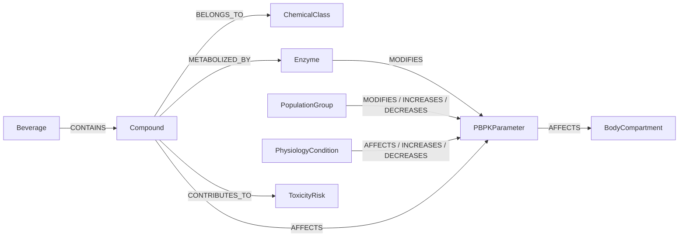

# Neo4j Graph Schema Design (Pre-Ingestion Freeze)

## Scope
This document freezes the ontology-first Neo4j schema for ingestion from:

- `data/processed/beverage/compound_profiles/beverage_compound_matrix_expanded.csv`
- `data/processed/human/human_metabolism_parameters.csv`
- `data/processed/pbpk/pbpk_parameter_library.csv`
- `data/processed/pbpk/population_modifiers.csv`
- `data/processed/pbpk/beverage_effect_modifiers.csv`

Design goals:

- deterministic graph construction
- causal/explainable traversal for PBPK and risk reasoning
- no relationships that cannot be grounded in current structured data or explicit deterministic mapping rules

## 1. Node Types
Required node labels and deterministic IDs.

### 1.1 `Beverage`
Source: `beverage_compound_matrix_expanded.csv`, `beverage_effect_modifiers.csv`

Properties:

- `beverage_id` (PK, e.g., `BVG000010`)
- `name` (`beverage_name`)
- `category`
- `source_dataset`

### 1.2 `Compound`
Source: `beverage_compound_matrix_expanded.csv`

Properties:

- `compound_key` (PK, `normalized_compound_name`)
- `name` (`compound_name`)
- `pubchem_cid`
- `chemical_category`
- `compound_role`
- `estimated_concentration`
- `concentration_unit`
- `digestion_effect`
- `metabolic_burden`
- `confidence_score`

### 1.3 `ChemicalClass`
Source: `beverage_compound_matrix_expanded.csv` (`source_compound_class`)

Properties:

- `class_key` (PK, normalized class string)
- `class_name`
- `expansion_type` (for class placeholders / family expansion context)

### 1.4 `Enzyme`
Source: deterministic mapping from `human_metabolism_parameters.parameter_name` and PBPK architecture

Properties:

- `enzyme_id` (PK)
- `name` (e.g., `ADH`, `ALDH`, `CYP2E1`, `Catalase`)
- `family` (e.g., `oxidative_metabolism`)

### 1.5 `PopulationGroup`
Source: `population_modifiers.csv`, `human_metabolism_parameters.csv`

Properties:

- `group_key` (PK)
- `name` (allowed set: `male`, `female`, `elderly`, `young_adult`, `high_bmi`, `low_bmi`, `fasted`, `fed`, `liver_impairment`, `general_population`)

### 1.6 `PBPKParameter`
Source: `pbpk_parameter_library.csv`

Properties:

- `parameter_id` (PK, e.g., `PBPKP00001`)
- `parameter_name`
- `compartment`
- `base_value`
- `unit`
- `population_group` (base scope, currently general population)
- `modifier`
- `modifier_reason`
- `confidence_score`
- `source_document`
- `source_parameter_id`

### 1.7 `BodyCompartment`
Source: controlled vocabulary + PBPK table (`compartment`)

Properties:

- `compartment_key` (PK)
- `name` (required: `stomach`, `gut`, `blood`, `liver`, `brain`, `muscle`, `fat`, `elimination`)

### 1.8 `ToxicityRisk`
Source: `beverage_effect_modifiers.csv` rows where `parameter_name` is risk-oriented

Properties:

- `risk_id` (PK, from `modifier_id`)
- `risk_type` (derived from `parameter_name`: `toxicity_response_modifier`, `sensitivity_modifier`, `hangover_amplification_modifier`)
- `modifier`
- `modifier_reason`
- `trigger_compounds`
- `source_compound_class`
- `confidence_score`

### 1.9 `PhysiologyCondition`
Source: `human_metabolism_parameters.csv` (`condition`, `domain`, `modifier_type`)

Properties:

- `condition_key` (PK, deterministic hash-safe normalized string from `domain|condition|modifier_type`)
- `condition`
- `domain`
- `modifier_type`
- `effect_direction`
- `evidence_text`
- `source_document`
- `source_page`
- `extract_method`
- `confidence_score`

## 2. Relationships
Required relationship vocabulary and directionality.

### 2.1 Beverage and Chemistry
- `(b:Beverage)-[:CONTAINS {expansion_type, source_file, source_row}]->(c:Compound)`
- `(c:Compound)-[:BELONGS_TO]->(k:ChemicalClass)`

### 2.2 Compound to PBPK / Risk
- `(c:Compound)-[:AFFECTS {reason, confidence_score}]->(p:PBPKParameter)`
  - from `beverage_effect_modifiers` when `parameter_name` is PBPK parameter (e.g., gastric/absorption modifiers)
- `(c:Compound)-[:CONTRIBUTES_TO {reason, confidence_score}]->(r:ToxicityRisk)`
  - for histamine/sulfite/congener-driven risk modifiers

### 2.3 Enzyme and Parameter Links
- `(c:Compound)-[:METABOLIZED_BY]->(e:Enzyme)`
  - deterministic only for known mappings:
    - ethanol -> ADH/CYP2E1
    - acetaldehyde -> ALDH
- `(e:Enzyme)-[:MODIFIES]->(p:PBPKParameter)`
  - ADH -> `adh_metabolism_rate`
  - ALDH -> `aldh_metabolism_rate`
  - CYP2E1 -> `cyp2e1_modifier`

### 2.4 Population and Physiology Effects
- `(g:PopulationGroup)-[:MODIFIES {modifier, modifier_reason, confidence_score, source_parameter_id}]->(p:PBPKParameter)`
  - from `population_modifiers.csv`
- `(g:PopulationGroup)-[:AFFECTS {effect_direction, confidence_score}]->(pc:PhysiologyCondition)`
  - from `human_metabolism_parameters.csv`

### 2.5 PBPK Parameter and Compartments
- `(p:PBPKParameter)-[:AFFECTS]->(bc:BodyCompartment)`
  - from `pbpk_parameter_library.compartment`

### 2.6 Signed Effects (explicit causal polarity)
For directional interpretability:

- use `:INCREASES` when modifier/effect > 1 or `effect_direction=increase`
- use `:DECREASES` when modifier/effect < 1 or `effect_direction=decrease`

Applied as additional edges from `PopulationGroup`, `Compound`, or `PhysiologyCondition` to `PBPKParameter`.

## 3. Node Property Contract
Minimal required property sets for ingestion completeness checks.

- `Beverage`: `beverage_id`, `name`, `category`
- `Compound`: `compound_key`, `name`, `pubchem_cid`, `chemical_category`
- `ChemicalClass`: `class_key`, `class_name`
- `Enzyme`: `enzyme_id`, `name`
- `PopulationGroup`: `group_key`, `name`
- `PBPKParameter`: `parameter_id`, `parameter_name`, `base_value`, `unit`
- `BodyCompartment`: `compartment_key`, `name`
- `ToxicityRisk`: `risk_id`, `risk_type`, `modifier`
- `PhysiologyCondition`: `condition_key`, `condition`, `domain`

## 4. Constraints, Indexes, and Directionality
### 4.1 Uniqueness Constraints
Create unique constraints:

- `Beverage(beverage_id)`
- `Compound(compound_key)`
- `ChemicalClass(class_key)`
- `Enzyme(enzyme_id)`
- `PopulationGroup(group_key)`
- `PBPKParameter(parameter_id)`
- `BodyCompartment(compartment_key)`
- `ToxicityRisk(risk_id)`
- `PhysiologyCondition(condition_key)`

### 4.2 Indexes
Create lookup indexes:

- `Beverage(name)`, `Beverage(category)`
- `Compound(pubchem_cid)`, `Compound(chemical_category)`
- `PBPKParameter(parameter_name)`, `PBPKParameter(compartment)`
- `PopulationGroup(name)`
- `PhysiologyCondition(domain)`, `PhysiologyCondition(effect_direction)`
- `ToxicityRisk(risk_type)`

### 4.3 Relationship Direction Rules
Use forward-causal direction consistently:

- source entity -> influenced entity
- example: `PopulationGroup -> PBPKParameter`, `Compound -> ToxicityRisk`, `PBPKParameter -> BodyCompartment`

This guarantees consistent query semantics and explainability path construction.

## 5. Explainability Paths
Deterministic traversal templates for RAG and causal QA.

### 5.1 Beverage to BAC Effect
`(Beverage)-[:CONTAINS]->(Compound)-[:AFFECTS|METABOLIZED_BY]->(Enzyme|PBPKParameter)-[:AFFECTS]->(BodyCompartment)`

Interpretation target: gastric absorption and elimination impact leading to BAC peak/timing changes.

### 5.2 Population-Specific PBPK Shift
`(PopulationGroup)-[:MODIFIES|INCREASES|DECREASES]->(PBPKParameter)-[:AFFECTS]->(BodyCompartment)`

Interpretation target: fed/fasted, sex, age, liver-status effects on rates and compartments.

### 5.3 Beverage Toxicity Chain
`(Beverage)-[:CONTAINS]->(Compound)-[:CONTRIBUTES_TO]->(ToxicityRisk)`

Interpretation target: histamine/sulfite/congener burden signals.

## 6. Deterministic Mapping Rules
Ingestion must use deterministic keys and no fuzzy merges:

1. `Beverage` key: `beverage_id` only.
2. `Compound` key: lowercase `normalized_compound_name`.
3. `ChemicalClass` key: lowercase normalized `source_compound_class`.
4. `PBPKParameter` key: `parameter_id`.
5. `PopulationGroup` key: lowercase allowed-name exact match.
6. `BodyCompartment` key: lowercase exact match from controlled set.
7. `PhysiologyCondition` key: normalized `domain|condition|modifier_type`.
8. `ToxicityRisk` key: `modifier_id`.
9. Enzyme mapping must use explicit controlled map; no inferred enzymes outside map.

## 7. Mermaid Ontology Diagram

## 8. Ingestion Safety Gate
`safe_for_neo4j_ingestion: true`

Rationale:

- all required node types and relationships are defined with deterministic keys
- relationship directions are fixed for causal consistency
- property contracts are grounded in current ETL outputs
- explainability paths are explicitly encoded for downstream RAG and PBPK reasoning
