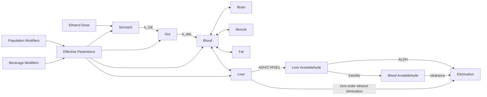

# PBPK V1 Architecture Design (ETL_06 Pre-Implementation Freeze)

## Scope
This document freezes the deterministic PBPK V1 mathematical architecture to be implemented in `simulation/pbpk/pbpk_master_simulator.py` using ETL_05 outputs:

- `data/processed/pbpk/pbpk_parameter_library.csv`
- `data/processed/pbpk/population_modifiers.csv`
- `data/processed/pbpk/beverage_effect_modifiers.csv`

V1 models ethanol and acetaldehyde kinetics with population and beverage modifier effects.

## 1. V1 Compartments
Required compartments are fixed:

1. `stomach`
2. `gut`
3. `blood`
4. `liver`
5. `brain`
6. `muscle`
7. `fat`
8. `elimination`

## 2. State Variables
All masses are in grams unless noted.

Primary ethanol states:

- `A_stomach_ethanol(t)` mass in stomach
- `A_gut_ethanol(t)` mass in gut lumen/absorptive space
- `A_blood_ethanol(t)` mass in central blood pool
- `A_liver_ethanol(t)` mass in liver
- `A_brain_ethanol(t)` mass in brain
- `A_muscle_ethanol(t)` mass in muscle
- `A_fat_ethanol(t)` mass in fat
- `A_eliminated_ethanol(t)` cumulative eliminated ethanol

Primary acetaldehyde states:

- `A_blood_acetaldehyde(t)`
- `A_liver_acetaldehyde(t)`
- `A_eliminated_acetaldehyde(t)`

Derived reporting states:

- `C_blood_ethanol_mg_L(t) = 1000 * A_blood_ethanol / V_blood`
- `BAC_percent(t) = C_blood_ethanol_mg_L / 10000`
- `metabolite_load(t) = A_blood_acetaldehyde + A_liver_acetaldehyde`

## 3. Transfer and Reaction Equations
### 3.1 Core Rate Constants and Flows
Use parameter symbols mapped from ETL_05:

- `k_GE` gastric emptying rate (`gastric_emptying_rate`)
- `k_abs` intestinal absorption rate (`intestinal_absorption_rate`)
- `k_dist_x` blood-to-tissue distribution rates (brain/muscle/fat/liver)
- `Q_liver` liver blood flow (`liver_blood_flow`)
- `k_ADH` ADH metabolism proxy (`adh_metabolism_rate`)
- `k_ALDH` ALDH metabolism proxy (`aldh_metabolism_rate`)
- `m_CYP2E1` CYP2E1 modifier (`cyp2e1_modifier`)
- `k_elim0` baseline ethanol elimination rate (`ethanol_elimination_rate`)
- `k_acald_clr` acetaldehyde clearance proxy (`acetaldehyde_clearance_rate`)

### 3.2 Stomach and Gut
\[
\frac{dA_{stomach}}{dt} = -k_{GE} \cdot A_{stomach}
\]
\[
\frac{dA_{gut}}{dt} = k_{GE} \cdot A_{stomach} - k_{abs} \cdot A_{gut}
\]

### 3.3 Blood and Tissue Distribution (Ethanol)
\[
\frac{dA_{blood}}{dt} =
+k_{abs}A_{gut}
+\sum_i k_{i \rightarrow blood}A_i
-\sum_i k_{blood \rightarrow i}A_{blood}
-k_{hep\_in}A_{blood}
\]
where \( i \in \{brain,muscle,fat\} \).

\[
\frac{dA_i}{dt} = k_{blood \rightarrow i}A_{blood} - k_{i \rightarrow blood}A_i
\]

### 3.4 Liver Ethanol Balance
\[
\frac{dA_{liver}}{dt} = k_{hep\_in}A_{blood} - k_{hep\_out}A_{liver} - R_{met,ethanol}
\]

### 3.5 Hepatic Metabolism (ADH, ALDH, CYP2E1)
Ethanol-to-acetaldehyde conversion:
\[
R_{met,ethanol} = R_{ADH} + R_{CYP2E1}
\]
\[
R_{ADH} = k_{ADH,eff}
\]
\[
R_{CYP2E1} = k_{CYP2E1,base} \cdot m_{CYP2E1}
\]

V1 assumption: use ETL-derived rates as deterministic effective rates with modifier scaling; do not introduce unobserved Michaelis-Menten constants.

Acetaldehyde formation and clearance:
\[
\frac{dA_{liver,acald}}{dt} = R_{met,ethanol} - R_{ALDH} - k_{acald,dist}A_{liver,acald}
\]
\[
R_{ALDH} = k_{ALDH,eff}
\]
\[
\frac{dA_{blood,acald}}{dt} = k_{acald,dist}A_{liver,acald} - k_{acald,clr}A_{blood,acald}
\]

### 3.6 Zero-Order Elimination
Ethanol elimination is modeled as zero-order up to available mass:
\[
R_{elim,0} = \min(k_{elim,eff}, A_{liver}/\Delta t_{safe})
\]
\[
\frac{dA_{eliminated,ethanol}}{dt} = R_{elim,0}
\]

Acetaldehyde elimination:
\[
\frac{dA_{eliminated,acald}}{dt} = k_{acald,clr}A_{blood,acald}
\]

## 4. Parameter Dependency Wiring
### 4.1 Population Modifiers
Effective parameter calculation:
\[
P_{eff} = P_{base} \times \prod m_{population}
\]
using `population_modifiers.csv` rows for selected population group.

Deterministic dependency examples:

- `fed` -> lower `k_GE` (slower gastric emptying)
- `female` -> lower `body_water_fraction` / `ethanol_distribution_volume`
- `elderly` -> reduced `ethanol_elimination_rate`
- `liver_impairment` -> reduced `adh_metabolism_rate`, `aldh_metabolism_rate`, and `ethanol_elimination_rate`

### 4.2 Beverage Chemistry Modifiers
Apply beverage modifiers for selected `beverage_id`:
\[
P_{eff} = P_{eff} \times \prod m_{beverage}
\]

Deterministic dependency examples:

- high sugar signal -> lower `intestinal_absorption_rate`
- carbonation signal -> higher `gastric_emptying_rate`
- histamine signal -> toxicity-input amplification
- sulfites signal -> sensitivity-input amplification
- congeners signal -> hangover/toxicity burden amplification

### 4.3 Modifier Application Order
For reproducibility, always apply in this order:

1. base value from `pbpk_parameter_library.csv`
2. population modifier(s)
3. beverage modifier(s)
4. safety clamps (nonnegative and physiologic bounds)

## 5. Units
Canonical V1 units:

- mass: `g`
- concentration: `mg/L`
- BAC: `%`
- time: `h`
- flow: `L/h` or `ml/min` (converted to `L/h` before ODE)
- rate constants: `1/h` (convert `1/min` to `1/h` before integration)
- distribution volume: `L/kg`

Required unit normalization before simulation:

- `1/min` -> multiply by `60` to get `1/h`
- `ml/min` -> multiply by `0.06` to get `L/h`

## 6. Numerical Method Selection
### 6.1 Comparison
Euler:

- Pros: simple, deterministic.
- Cons: high truncation error, unstable for multi-compartment stiff-like dynamics.

RK4 (fixed-step):

- Pros: better accuracy than Euler, deterministic.
- Cons: manual step control, can still struggle with mixed fast/slow rates.

SciPy `solve_ivp`:

- Pros: robust adaptive integration, event handling support, mature implementation.
- Cons: slightly higher complexity.

### 6.2 V1 Recommendation
Use `scipy.integrate.solve_ivp` with deterministic settings:

- method: `RK45` for V1 baseline
- fixed `t_eval` grid (e.g., 0 to 24 h, 0.01 to 0.1 h step)
- fixed tolerances: `rtol=1e-6`, `atol=1e-9`
- deterministic preprocessing and parameter ordering

If instability appears for extreme modifier combinations, switch method to `LSODA` or `BDF` with the same fixed `t_eval` policy.

## 7. Required Simulation Outputs
For each run, emit:

1. `BAC_curve` time series (`time_h`, `BAC_percent`)
2. `time_to_peak_h`
3. `time_to_sober_h` (first time BAC below threshold, default 0.02%)
4. `acetaldehyde_curve` (`time_h`, `acetaldehyde_mg_L` or mass proxy)
5. `metabolism_rate` summary (`R_met` and `R_elim` profiles)
6. `compound_burden` summary (AUC-like burden for ethanol and acetaldehyde)
7. `toxicity_risk_inputs`:
   - max BAC
   - acetaldehyde peak
   - histamine/sulfite/congener modifier signals

## 8. Architecture Diagram

## 9. Implementation Gate
`safe_for_pbpk_implementation: true`

Rationale:

- ETL_05 provides deterministic base parameters and modifier tables.
- Required compartments and core parameter hooks are defined.
- Numerical approach is selected with reproducible settings.
- Output contract is fully specified for ETL_06 simulation integration.
